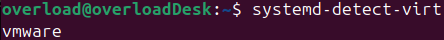
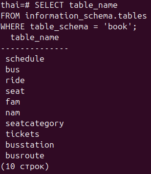
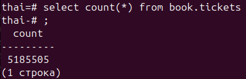

**1. Развернуть ВМ (Linux) с PostgreSQL (у вас есть ВМ в ВБ, любой другой способ, в т.ч.
докер)**

**2. Залить Тайские перевозки в минимальном варианте.**

**3. Посчитать количество поездок - select count(*) from book.tickets;**

Количество поездок - 5185505.

**4. Не забываем ВМ остановить/удалить.**

Остановил.