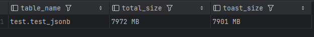
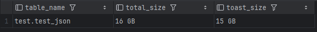
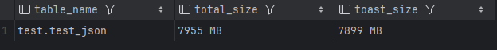
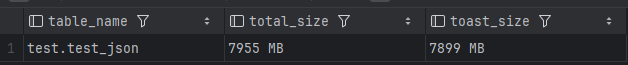

1. Сгенерировать таблицу с 1 млн JSONB документов
```sql
CREATE TABLE test.test_jsonb (
    id INTEGER PRIMARY KEY,
    data JSONB
);

INSERT INTO test.test_jsonb (id,data)
SELECT i AS id, (SELECT jsonb_object_agg(j, j) FROM generate_series(1, 1000) j) js
FROM generate_series(1, 1000000) i;
```
Размер таблицы и тоста после вставки данных:
Видно что pg начал использовать тосты для хранения огромных json'ов.

```sql
SELECT oid::regclass AS heap_rel,
       pg_size_pretty(pg_relation_size(oid)) AS heap_rel_size,
       reltoastrelid::regclass AS toast_rel,
       pg_size_pretty(pg_relation_size(reltoastrelid)) AS toast_rel_size
FROM pg_class WHERE relname = 'test_jsonb';
```



2. Создать индекс
```sql
CREATE INDEX idx_jsonb_2 ON test.test_jsonb ((data->>'2'));
```

3. Обновить 1 из полей в json
```sql
UPDATE test.test_json SET data = data::jsonb || '{"a":1}';
```

4. Убедиться в блоатинге TOAST



5. Придумать метод избавится от него и проверить на практике
Есть такие способы:
Банальный вакум.
```sql
VACUUM FULL test.test_jsonb;
```
Результат:



Упорядочивание по индексу
```sql
CLUSTER test.test_jsonb USING idx_jsonb_2;
```
Результат:


