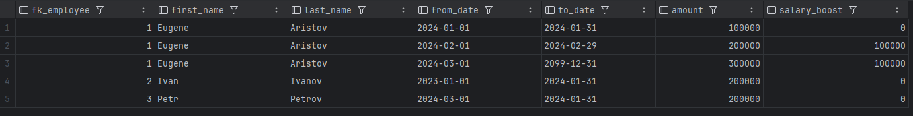

Проанализировать данные о зарплатах сотрудников с использованием оконных функций.
а) На сколько было увеличение с предыдущей зарплатой
б) если это первая зарплата - вместо NULL вывести 0

Запрос:
```sql
SELECT s.fk_employee,
       e.first_name,
       e.last_name,
       s.from_date,
       s.to_date,
       s.amount,
       COALESCE(s.amount - LAG(s.amount) OVER (PARTITION BY s.fk_employee ORDER BY s.from_date), 0) AS salary_boost
FROM salary s
         INNER JOIN employee e ON e.id = s.fk_employee;
```

Результат:

