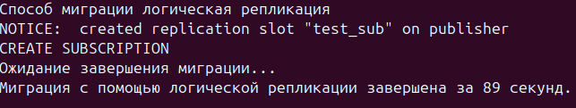

1. Установить 16 ПГ
2. Залить средние Тайские перевозки
3. Рядом поднять кластер 17 версии
4. Протестировать скорость онлайн вариантов миграции (логическая репликация, postgres_fdw, pg_dump/pg_restore) 

Поднял кластеры 16 и 17 версии.


Залил тайские перевозки средние на 16 версию.


Проверка производительности миграции. 

Перед каждым тестом полностью удалял целевой кластер(17 main 5433) для чистоты замеров таким скриптом:
```bash
sudo pg_dropcluster 17 main --stop
sudo pg_createcluster 17 main --port=5433
sudo pg_ctlcluster 17 main start
sudo -u postgres psql -p 5433 -c "CREATE ROLE over WITH LOGIN PASSWORD 'qWE123' SUPERUSER;"
sudo -u postgres psql -p 5433 -c "CREATE database over;"
psql -p 5433 -U over -d postgres -c "ALTER SYSTEM SET wal_level = logical;"
sudo pg_ctlcluster 17 main restart
```

Логическая репликация.

Подготовка БД.
```bash
psql -p 5432 -U over -d postgres -c "ALTER SYSTEM SET wal_level = logical;"
psql -p 5433 -U over -d postgres -c "ALTER SYSTEM SET wal_level = logical;"
psql -p 5433 -U over -d thai -f ~/schema.sql
psql -p 5432 -U over -d thai -c "CREATE PUBLICATION test_pub FOR TABLES IN SCHEMA book;"
```

Скрипт для проверки количества времени чтобы перенести данные.

```bash
#!/bin/bash

echo "Способ миграции логическая репликация"
START=$(date +%s)
psql -p 5433 -U over -d thai -c "
  CREATE SUBSCRIPTION test_sub
  CONNECTION 'host=localhost port=5432 user=over password=qWE123 dbname=thai'
  PUBLICATION test_pub WITH (copy_data = true);
"

echo "Ожидание завершения миграции..."
while true; do
  sleep 2
  src=$(psql -p 5432 -U over -d thai -tAc "SELECT count(*) FROM book.tickets;")
  dst=$(psql -p 5433 -U over -d thai -tAc "SELECT count(*) FROM book.tickets;")
  [[ "$src" == "$dst" ]] && break
done
END=$(date +%s)
echo "Миграция с помощью логической репликации завершена за $((END - START)) секунд."
```
Результат:

89 секунд



Проверка производительности варианта postgres_fdw.

Скрипт для проверки количества времени чтобы перенести данные.

```bash
#!/bin/bash

echo "Способ миграции postgres_fdw"
START=$(date +%s)

psql -p 5433 -U over -d thai -c "
  IMPORT FOREIGN SCHEMA book FROM SERVER myserver INTO book;
"
echo "Ожидание завершения миграции..."
while true; do
  sleep 2
  src=$(psql -p 5432 -U over -d thai -tAc "SELECT count(*) FROM book.tickets;")
  dst=$(psql -p 5433 -U over -d thai -tAc "SELECT count(*) FROM book.tickets;")
  [[ "$src" == "$dst" ]] && break
done
END=$(date +%s)
echo "Миграция через postgres_fdw и проверка завершены за $((END - START)) секунд."
```

Результат:

8 секунд.


Проверка производительности варианта через pg_dump/pg_restore.

Скрипт для проверки количества времени чтобы перенести данные, включая проверку данных.

```bash
#!/bin/bash

echo "Способ миграции pg_dump/pg_restore"
START=$(date +%s)
pg_dump -p 5432 -U over -Fc -d thai --create > ~/thai_backup.gz
psql -p 5433 -U over -d postgres -c "CREATE DATABASE thai;"
pg_restore -p 5433 -U over -d thai -Fc ~/thai_backup.gz

echo "Ожидание завершения миграции..."
while true; do
  sleep 2
  src=$(psql -p 5432 -U over -d thai -tAc "SELECT count(*) FROM book.tickets;")
  dst=$(psql -p 5433 -U over -d thai -tAc "SELECT count(*) FROM book.tickets;")
  [[ "$src" == "$dst" ]] && break
done
END=$(date +%s)
echo "Миграция с помощью pg_dump/pg_restore завершена за $((END - START)) секунд."
```

Результат: 

165 секунд


Итоговые результаты теста:

Логическая репликация - 89 секунд
postgres_fdw - 8 секунд
pg_dump/pg_restore - 165 секунд