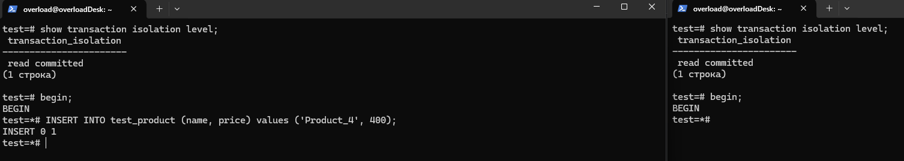

**1. открыть консоль и зайти по ssh на ВМ в ЯО/любое другое подключение**

**2. открыть вторую консоль и также зайти по ssh на ту же ВМ в ЯО**

**3. запустить везде psql из под пользователя postgres к одному кластеру ПГ**

**4. сделать в первой сессии новую таблицу и наполнить ее данными**

**5. посмотреть текущий уровень изоляции:**

**6. начать новую транзакцию в обоех сессиях с дефолтным (не меняя) уровнем изоляции**

**7. в первой сессии добавить новую запись**

**8. сделать запрос на выбор всех записей во второй сессии**

**9. видите ли вы новую запись и если да то почему?**

Не увидел, т.к. по дефолту в постгресе уровень изоляции read commited и запрос во втором окне увидит только закомиченные данные на момент выполнения.

**10. завершить транзакцию в первом окне**

**11. сделать запрос на выбор всех записей второй сессии**

**12. видите ли вы новую запись и если да то почему?**

Да, вижу, т.к. изменения в таблице на момент выполнения запроса во втором окне были зафиксированы с помощью commited; в первом окне.

**13. завершите транзакцию во второй сессии**

**14. начать новые транзакции, но уже на уровне repeatable read в ОБЕИХ сессиях**

**15. в первой сессии добавить новую запись**

**16. сделать запрос на выбор всех записей во второй сессии**

**17. видите ли вы новую запись и если да то почему?**

Нет, не вижу, т.к. все запросы во втором окне в рамках начатой транзакции на уровне repeatable read не будут видеть изменения сделанные в других транзакциях, даже закомиченные.

**18. завершить транзакцию в первом окне**

**19. сделать запрос во выбор всех записей второй сессии**

**20. видите ли вы новую запись и если да то почему?**

Нет, не вижу.