**1. Создать таблицу с текстовым полем и заполнить случайными или
сгенерированными данным в размере 1 млн строк**

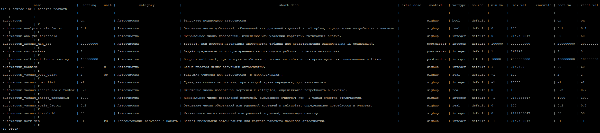

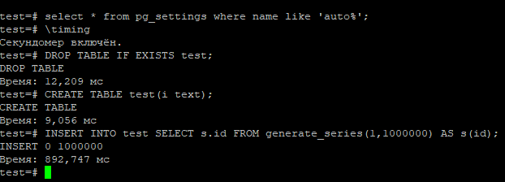

**2. Посмотреть размер файла с таблицей**

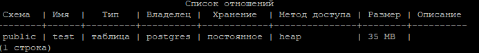

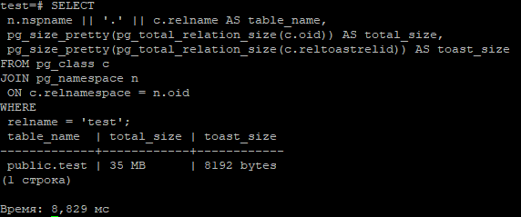

**3. 5 раз обновить все строчки и добавить к каждой строчке любой символ**

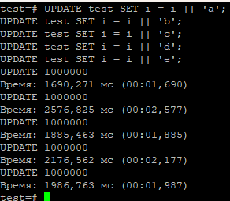

**4. Посмотреть количество мертвых строчек в таблице и когда последний раз
приходил автовакуум**

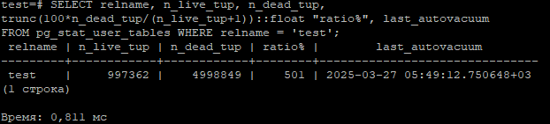

**5. Подождать некоторое время, проверяя, пришел ли автовакуум**

Дождался прохода автовакуума.

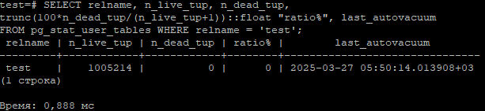

**6. 5 раз обновить все строчки и добавить к каждой строчке любой символ**

Обновил 5 раз все строки.

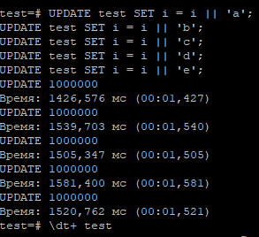

**7. Посмотреть размер файла с таблицей**
Размер 260 МБ.

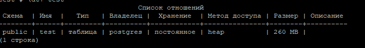

**8. Отключить Автовакуум на конкретной таблице**

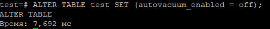

**9. 10 раз обновить все строчки и добавить к каждой строчке любой символ**

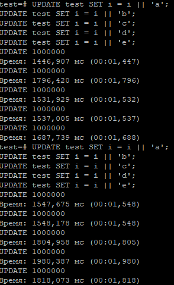

**10. Посмотреть размер файла с таблицей**
Размер 569 МБ.

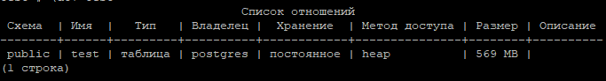

**11. Объясните полученный результат**

После отключения автовакуума старые версии строк начинают накапливаться, и при обновлении строк postgres вынужден использовать больше места для хранения старых версий строк. 
С включенным автовакуумом видно что таблица выросла после 5 апдейтов, отработал автовакуум, очистил старые версии строк и при следующих 5 апдейтах postgres использовал место в таблице которое освободилось автовакуумом.

**12. Не забудьте включить автовакуум)**

Включил, спасибо, FULL тоже)