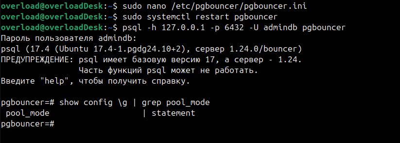

**1. PgBouncer pool_mode = session**

Не перевожу PgBouncer в режим session, т.к. он по дефолту.

Работа PgBouncer в режиме session:

**2. PgBouncer pool_mode = transaction**

Перевожу PgBouncer в режим transaction:

Работа PgBouncer в режиме transaction:

**3. PgBouncer pool_mode = statement**

Перевожу PgBouncer в режим statement:

Работа PgBouncer в режиме statement:

Результаты тестирования производительности показали следующее:
1) Наиболее эффективный режим — statement.
2) Средний уровень производительности — transaction, немного уступает режиму statement.
3) Наименее производительный режим — session.