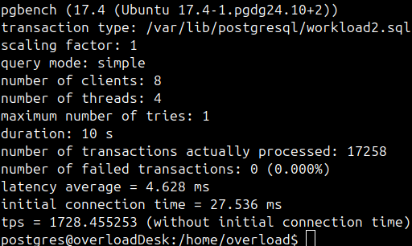
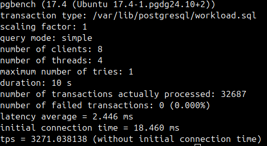

**1. Развертывание основного инстанса и реплики**

Развернул основной инстанс:

Развернул реплику:

**2. Тестирование производительности с репликой**

Тест на запись:

Тест на чтение:

**2. Тестирование производительности без реплики**

Тест на запись:

Тест на чтение:

Итог: без реплики скорость выполнения запросов на чтение и на запись ускоряется в 2 раза.