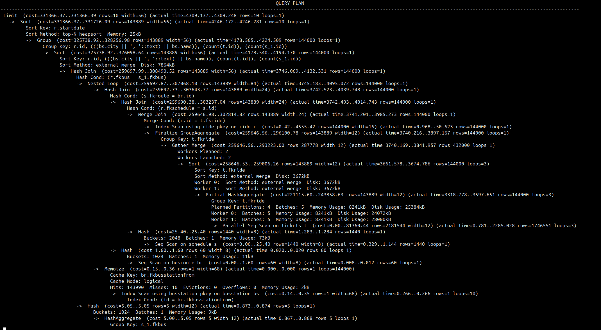
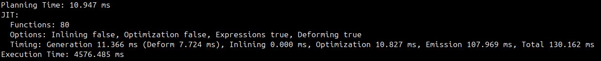
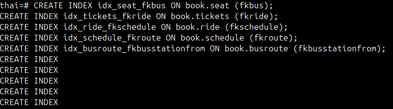
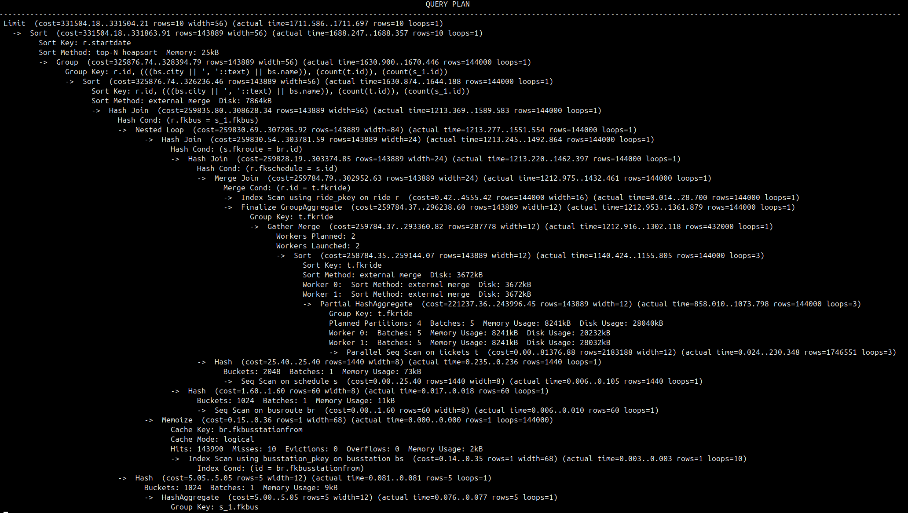
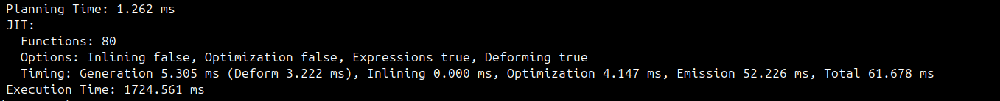

**1. Результат теста запрос без индексов**

**2. Навешиваю индексы**

**3. Результат теста запрос с индексами**

В результатах теста с индексами видно что активировался index scan вместо seq и снизилось время планирования и выполнения запроса в несколько раз. Это подтверждает, что индексы на внешние ключи эффективно оптимизировали производительность запроса.