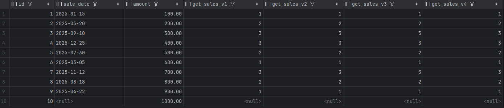

1. Создать таблицу с продажами.
2. Реализовать функцию выбор трети года (1-4 мес - первая треть, 5-8 - вторая и т.д.)
a. Через case
b. * (бонуса в виде зачета дз не будет) используя математическую операцию (лучше 2+ варианта)
c. предусмотреть NULL на входе
3. Вызвать эту функцию в SELECT из таблицы с продажами, убедиться, что всё отработало

``` sql

CREATE TABLE test.sales
(
    id        SERIAL PRIMARY KEY,
    sale_date DATE           NULL,
    amount    DECIMAL(10, 2) NULL
);

INSERT INTO test.sales (sale_date, amount)
VALUES ('2025-01-15', 100.00),
       ('2025-05-20', 200.00),
       ('2025-09-10', 300.00),
       ('2025-12-25', 400.00),
       ('2025-07-30', 500.00),
       ('2025-03-05', 600.00),
       ('2025-11-12', 700.00),
       ('2025-08-18', 800.00),
       ('2025-04-22', 900.00),
       (null, 1000.00);

CREATE OR REPLACE FUNCTION test.get_sales_v1(sale_date DATE) RETURNS INTEGER
AS
'SELECT CASE
            WHEN EXTRACT(MONTH FROM sale_date) BETWEEN 1 AND 4 THEN 1
            WHEN EXTRACT(MONTH FROM sale_date) BETWEEN 5 AND 8 THEN 2
            WHEN EXTRACT(MONTH FROM sale_date) BETWEEN 9 AND 12 THEN 3
            ELSE NULL
            END;'
    LANGUAGE SQL
    IMMUTABLE
    RETURNS NULL ON NULL INPUT;

CREATE OR REPLACE FUNCTION test.get_sales_v2(sale_date DATE) RETURNS INTEGER
AS
'SELECT FLOOR((EXTRACT(MONTH FROM sale_date) + 3) / 4.0);'
    LANGUAGE SQL
    IMMUTABLE
    RETURNS NULL ON NULL INPUT;

CREATE OR REPLACE FUNCTION test.get_sales_v3(sale_date DATE) RETURNS INTEGER
AS
'SELECT (ARRAY [1, 1, 1, 1, 2, 2, 2, 2, 3, 3, 3, 3])[EXTRACT(MONTH FROM sale_date)];'
    LANGUAGE SQL
    IMMUTABLE
    RETURNS NULL ON NULL INPUT;

CREATE OR REPLACE FUNCTION test.get_sales_v4(sale_date DATE) RETURNS INTEGER
AS
'SELECT WIDTH_BUCKET(EXTRACT(MONTH FROM sale_date), 1, 13, 3);'
    LANGUAGE SQL
    IMMUTABLE
    RETURNS NULL ON NULL INPUT;

SELECT id,
       sale_date,
       amount,
       test.get_sales_v1(sale_date) AS get_sales_v1,
       test.get_sales_v2(sale_date) AS get_sales_v2,
       test.get_sales_v3(sale_date) AS get_sales_v3,
       test.get_sales_v4(sale_date) AS get_sales_v4
FROM test.sales;

``` 

**Результат запроса с индексами**
