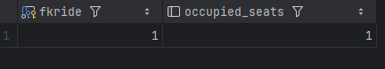

9. Реализовать итоговую таблицу подсчета Тайских перевозок, написать триггер, чтобы на вставку записи увеличить на поездке количество занятых мест в автобусе. Оценить падение производительности по сравнению со вставкой без триггера

**Создание таблицы и триггера.**
```sql
CREATE TABLE book.ride_sum
(
    fkride         INTEGER PRIMARY KEY REFERENCES book.ride,
    occupied_seats INTEGER DEFAULT 0
);

CREATE OR REPLACE FUNCTION trg_increase_occupied_seats()
RETURNS TRIGGER AS
$$
BEGIN
    INSERT INTO book.ride_sum AS rs (fkride, occupied_seats)
    VALUES (NEW.fkride, 1)
    ON CONFLICT (fkride)
    DO UPDATE SET occupied_seats = rs.occupied_seats + 1;
    RETURN NEW;
END;
$$ LANGUAGE plpgsql;

CREATE TRIGGER trg_update_ride_sum
AFTER INSERT ON book.tickets
FOR EACH ROW
EXECUTE PROCEDURE trg_increase_occupied_seats();

```
**Проверка работы триггера при вставке:**

```sql
INSERT INTO book.tickets (fkride, fio, contact, fkseat)
    SELECT 1, 'Иванов Иван', '{"phone": "+77984070123"}'::jsonb, 1;

select * from book.ride_sum;
```

В результате появилась строка со счетчиком.



**Тестирование производительности без триггера и с триггером.**
```sql
BEGIN;
ALTER TABLE book.tickets DISABLE TRIGGER trg_update_ride_sum;

DO $$
DECLARE
    t_start TIMESTAMP;
    t_end   TIMESTAMP;
BEGIN
    t_start := CLOCK_TIMESTAMP();

    INSERT INTO book.tickets (fkride, fio, contact, fkseat)
    SELECT 1, 'Иванов Иван', '{"phone": "+77984070123"}'::jsonb, 1;

    t_end := CLOCK_TIMESTAMP();

    RAISE NOTICE 'Время вставки без триггера: % секунд', EXTRACT(EPOCH FROM t_end - t_start);
END;
$$;
ROLLBACK;


BEGIN;
DO $$
DECLARE
    t_start TIMESTAMP;
    t_end   TIMESTAMP;
BEGIN
    t_start := CLOCK_TIMESTAMP();

    INSERT INTO book.tickets (fkride, fio, contact, fkseat)
    SELECT 1, 'Иванов Иван', '{"phone": "+77984070123"}'::jsonb, 1;

    t_end := CLOCK_TIMESTAMP();

    RAISE NOTICE 'Время вставки с триггером: % секунд', EXTRACT(EPOCH FROM t_end - t_start);
END;
$$;
ROLLBACK;

```
Получил такие тайминги.

Время вставки без триггера: 0.000179 секунд

Время вставки с триггером: 0.000334 секунд

Таким образом, добавление триггера увеличило время выполнения примерно на 80%, что является довольно критическим при единичной вставке, а при массовых вставках производительность будет куда хуже.